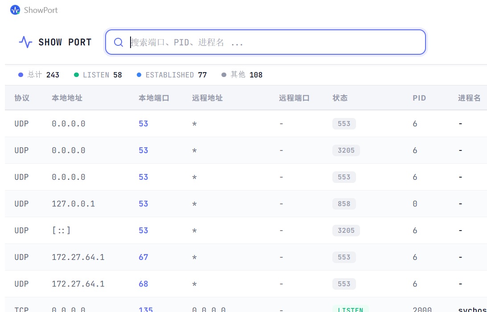

# ShowPort

[English](#english) | [中文](#中文)

---

## English

> Tired of typing `netstat -ano | findstr` every time you need to check a port on Windows? This GUI tool lets you see all ports at a glance and kill any process with one click.

> Supports **English / Chinese** toggle in-app.



### Download

**No Python needed. Just download the exe and double-click.**

#### [>>> Download ShowPort.exe <<<](https://github.com/deeperxh/showport/releases/latest/download/ShowPort.exe)

> Killing processes requires admin privileges. Right-click → **Run as administrator**.

### Features

| Feature | Description |
|---------|-------------|
| Port List | All TCP/UDP connections — protocol, address, port, status, PID, process name |
| Search | Filter by port, PID, or process name in real time with keyword highlighting |
| Sort | Click any column header to sort ascending/descending |
| Kill | Kill button on each row with a confirmation dialog |
| Auto Refresh | Toggle 3-second auto refresh in the toolbar |
| Stats | Total, LISTEN, ESTABLISHED counts at the top |
| i18n | Switch between Chinese and English via the toolbar button |

### Shortcuts

| Key | Action |
|-----|--------|
| `Ctrl+R` / `F5` | Refresh |
| `Ctrl+F` | Focus search |
| `Esc` | Clear search |

### Run from Source

```bash
git clone https://github.com/deeperxh/showport.git
cd showport
pip install -r requirements.txt
python port_manager.py
```

### Build exe

```bash
pip install pyinstaller
pyinstaller --onefile --windowed --name ShowPort --icon=icon.ico port_manager.py
```

### Tech Stack

Python + pywebview (Edge WebView2) + psutil + PyInstaller

---

## 中文

> Windows 上查端口占用每次都要敲 `netstat -ano | findstr`，记不住还费劲。做了个图形界面，双击打开就能看，想杀哪个进程点一下就行。

> 支持应用内**中英文切换**。


### 下载使用

**不需要安装 Python，不需要任何环境，下载 exe 双击就能用。**

#### [>>> 点击下载 ShowPort.exe <<<](https://github.com/deeperxh/showport/releases/latest/download/ShowPort.exe)

> 杀进程需要管理员权限，建议**右键 → 以管理员身份运行**。

### 功能一览

| 功能 | 说明 |
|------|------|
| 端口列表 | 显示所有 TCP/UDP 连接，包括协议、地址、端口、状态、PID、进程名 |
| 实时搜索 | 输入端口号、PID 或进程名，即时过滤，关键字高亮显示 |
| 列排序 | 点击表头，按任意列升序/降序排列 |
| 一键 Kill | 每行都有 Kill 按钮，点击后弹出确认框，确认后终止进程 |
| 自动刷新 | 工具栏可开启 3 秒自动刷新，实时监控端口变化 |
| 统计概览 | 顶部显示连接总数、LISTEN 数、ESTABLISHED 数 |
| 中英文切换 | 工具栏按钮一键切换中英文界面 |

### 快捷键

| 按键 | 功能 |
|------|------|
| `Ctrl+R` / `F5` | 刷新列表 |
| `Ctrl+F` | 聚焦搜索框 |
| `Esc` | 清空搜索 |

### 从源码运行

```bash
git clone https://github.com/deeperxh/showport.git
cd showport
pip install -r requirements.txt
python port_manager.py
```

### 自己打包 exe

```bash
pip install pyinstaller
pyinstaller --onefile --windowed --name ShowPort --icon=icon.ico port_manager.py
```

### 技术栈

Python + pywebview (Edge WebView2) + psutil + PyInstaller

---

## License

MIT
